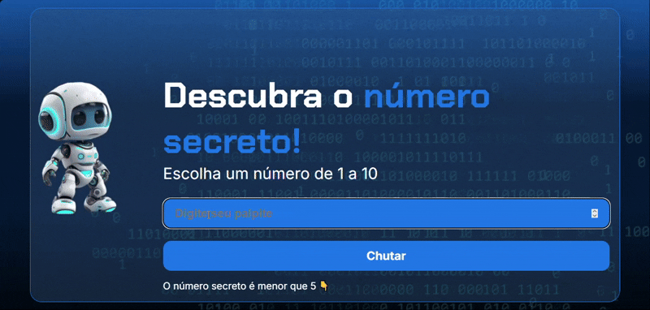

# 🎯 Jogo do Número Secreto  

<a href="#-tecnologias">Tecnologias</a>&nbsp;&nbsp;&nbsp;|&nbsp;&nbsp;&nbsp;

 
Um mini game divertido desenvolvido com **HTML**, **CSS** e **JavaScript**, onde o jogador precisa adivinhar um número secreto entre **1 e 10**.  
O projeto combina **design animado**, **feedbacks interativos** e **efeitos visuais** de vitória (como confete e brilho no fundo).  

---

## 🖼️ Demonstração  

  

## 🚀 Funcionalidades  

✅ Geração aleatória de número secreto (1 a 10)  
✅ Feedback dinâmico: "maior" ou "menor"  
✅ Contador de tentativas  
✅ Efeito de vitória com confete 🎉  
✅ Fundo animado e visual moderno ✨  
✅ Robô e troféu com leve animação flutuante 🤖🏆  
✅ Botão dinâmico que muda para "Jogar novamente" ao vencer  

---

## 🧠 Tecnologias  

| Tecnologia | Função |
|-------------|--------|
| **HTML5** | Estrutura e marcação do jogo |
| **CSS3** | Estilo, animações e layout responsivo |
| **JavaScript (ES6)** | Lógica, interatividade e validações |
| **Google Fonts** | Fontes *Inter* e *Chakra Petch* |

---

